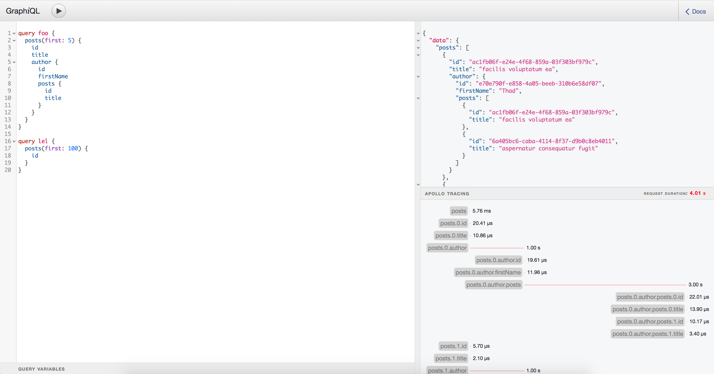

# GraphiQL Apollo  Tracing Support

This is a prove of concept implementation that could be implemented in apollo-server by default.

## Install

1. Clone this repository
2. cd into this repository
3. run `yarn install`
4. run `yarn dev`
5. visit `localhost:3000/graphiql`

## Roadmap

- Better styling/visualisation of the data
- Figure out how to implement with apollo-server
